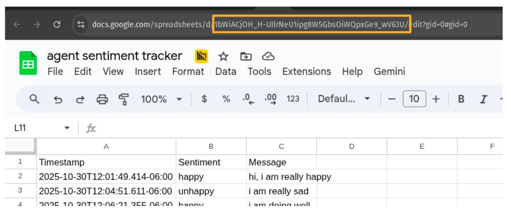
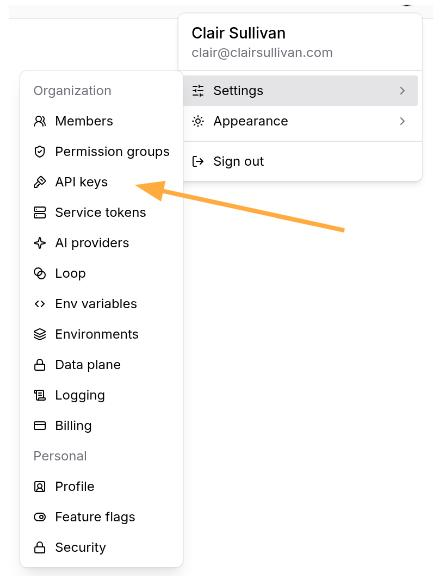

# Welcome to Agentic AI with Orchestrated Workflows for Engineers!

We are very excited to have you as part of this course!  

In this course we will be doing a great deal of hands-on work with both the n8n orchestration platform as well as various AI models and APIs.  You will learn how to create agentic workflows that can perform complex tasks with minimal human intervention.  By the end of this course, you will have the skills and knowledge to build your own agentic AI solutions for a variety of applications.

In order to achieve this, you will need to set up a variety of accounts and API keys.  This guide will walk you through what you need to do to get started.

## n8n Cloud

**Click [here](https://youtu.be/rWWxLD_Sfjo) for a short video overview for how to get started in n8n for this course.**

In this course we will be working in the n8n Cloud environment that has been specifically created for this workshop: [https://billworkshop.app.n8n.cloud](https://billworkshop.app.n8n.cloud).  You should have already received an email invitation to join the n8n Cloud platform.  Your assigned team will be working within an assigned project on the Bill n8n cloud environment.  It is recommended that you and your team create some organization within your project, such as each team member having their own folder for their individual activities.  Be sure that you store any shared credentials within this project so that all team members can access them.  

## Google Gemini

You will be accessing Google Gemini through a shared, Enterprise credential.  The use of this credential will be demonstrated to you during the Module 1 lecture.

## Google Sheets

There are various activities and challenges in this course that will require you to read from and write to Google Sheets.  You will be connecting to the Google Sheets you create via OAuth2 authentication.  When you do this, you will be able to select the appropriate sheet from a list via a dropdown menu.

However, it is also possible to connect to a Google Sheet via the ID of the particular sheet you are working with.  To find the ID of a Google Sheet, open the sheet in your web browser.  The URL will look something like this:

The ID is the string of characters shown above in the orange box between `.../d/` and `/edit?gid=...`.  

## GitHub

For some of the challenges in this course, you will be required to interact with GitHub repositories.  You will need to create a GitHub account if you do not already have one.  If you need to create an account, [sign up here](https://github.com/signup).  You will then be connecting to this account via OAuth2 authentication within n8n.

## Visual Crossing

In one of our activities we will be working with a free weather API from Visual Crossing.  You will need to go to [visualcrossing.com](https://www.visualcrossing.com/) and click "Sign Up" in the upper right corner.  You can create a free account using your email address.  Once you have created your account, you will need to obtain an API key.  To do this, click on the "Account" button in the upper right corner.  This will take you to your Account page where you will be able to see your API key.  Copy this key and save it somewhere safe, as you will need it later in the course.

**Important:** Please create this API key using a personal email address and NOT your Bill.com email address!

## Bill.com API

In Module 2 we will be creating agentic workflows that interact with the Bill.com v3 API.  In particular, some invoices have been pre-staged in a sandbox account for you to work with.  You will use the following credentials to access the Bill.com v3 API:

- `url`: `https://gateway.stage.bill.com/connect/v3`
- `username`: `sullivanclair099@gmail.com`
- `password`: _to be provided in class_
- `organizationId`: _to be provided in class_
- `devKey`: _to be provided in class_

## SEC API

For some of the challenge problems you will be creating agentic workflows that interact with the SEC EDGAR API to retrieve company filings.  In order to do this, you will need to create an API key to their database, which you can do at [sec-api.io](https://sec-api.io/).  

**Important:** Please create this API key using a personal email address and NOT your Bill.com email address!

## Braintrust

**Click [here](https://youtu.be/P6pEW-TxE0k) for a short video overview for how to get started in Braintrust for this course.**  The following is a summary of this video.

We will be using a sandbox environment in Braintrust to do automated evaluation of of our agentic workflow:s: [https://www.braintrust.dev/app/BILLWORKSHOP/](https://www.braintrust.dev/app/BILLWORKSHOP/).  You should have already received an email invitation to join the Braintrust platform.  If you have not received this email, please let the instructor know.

In order to access Braintrust via n8n through the REST API, you will need to create an API key.  To get one, go into Braintrust and click on your avatar in the upper right and select "Settings" from the dropdown.  Then click on the "API Keys" tab on the left. 

