# Module 1 Activities: Foundational Agentic Patterns

In this module we will learn the basics of how to use n8n for basic agentic workflows.  At this point, you should be able to log into n8n.  We will start with a basic chatbot and work on building it out to add more complexity.

## Module 1, Activity 1: Basic Chatbot

We will begin by creating our first workflow.  From the n8n dashboard, click on your Peronsal workspace.  Then click on "New Workflow" in the upper right corner.  This will open a blank workflow.  

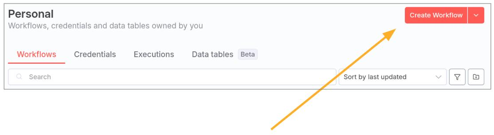

The first thing to know is that all n8n workflows start with a trigger node.  This is the node that tells n8n when to start the workflow.  For many workflows, we will use the "Manual Trigger" node.  This allows us to manually start the workflow by clicking a button.  However, our first workflow in this course will be a chatbot, so we want to use a chat trigger.  Click the "+" button in the upper right to open the Nodes Panel.  In the node search bar, type "chat" and select the "Chat Trigger" node.

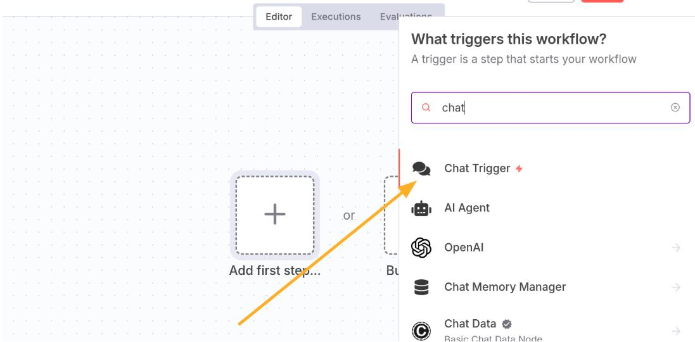

At this point we do not need to adjust any of the parameters or settings for this node so we can return back to the canvas.  Observe in the lower left a chat window has been opened.  It isn't connected to anything (yet!) so it won't do anything, but this is where we will interact with our chatbot.

Now we need to connect our chatbot to an AI.  We will be using the n8n AI Agent for this course.  Click the "+" button again to open the Nodes Panel.  In the search bar, type "AI Agent" and select the "AI Agent" node.  This will then open the AI Agent node, where you will see the following:

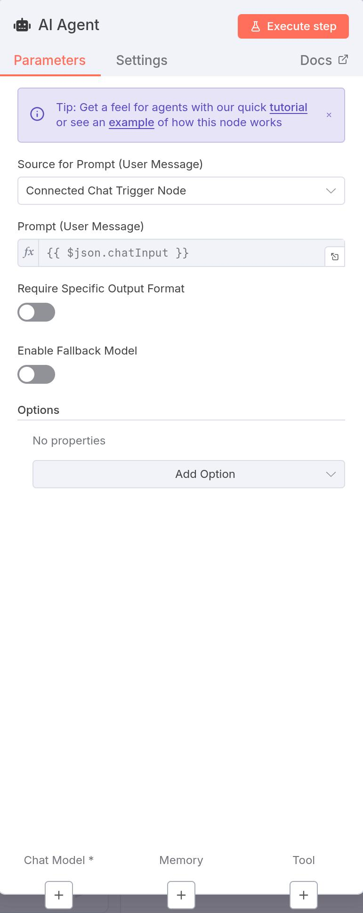

There are a couple of key things to notice for this node.  First, we can see that the source for the prompt (AKA the user message) is "Connected Chat Trigger Node."  In fact, if you return to the canvas, you will see that the chat trigger node has been connected to the AI agent node.  This means that the agent is waiting for input from the chat window.  Later in this workshop we will not be running our agents based on chat but more sophisticated workflows.  But for this exercise, this is what we want.  Next you will see that the prompt (user message) is set to `{{ $json.chatInput }}`.  We will see in just a second that when we enter a message in the chat window, it will be stored in the variable `chatInput`.  This is how the AI agent node knows what the user said.  

Notice that there is a red asterisk below the AI Agent node next to "Chat Model."  This indicates that this is a required field.  ("Memory" and "Tool" are not required and we will discuss them shortly.)  This means that we need to hook our agent up to a large language model (LLM) to power our chat.  If you click on the "+" symbol there you will see a variety of options for chat models.  In this course, we will largely work with the Google Gemini Chat Model.  So select that model, which will bring up the following screen:

### Working with and Adding Credentials

Credentials are stored in a separate location within n8n.  In order to find them, you will go to your n8n launch page under either the Overview page or the Personal page and select "Credentials," as shown here:

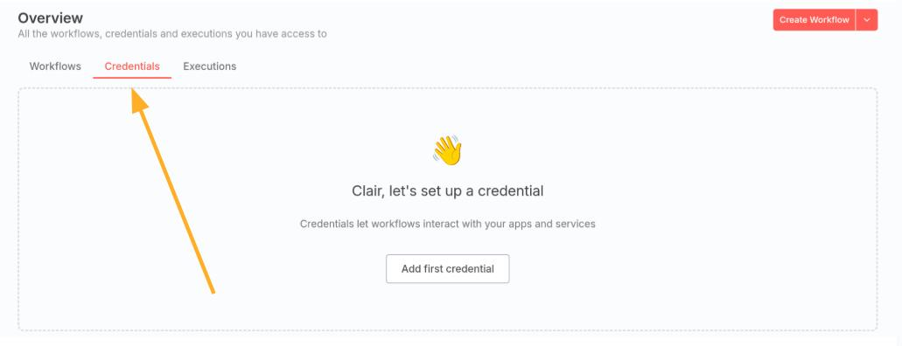

If you look in the Overview page, you will see a series of shared credentials that have been created for you to use in this course, such as the Global Gemini Credentials and the Global Openai Credentials.  Should you wish to create your own credentials, **go into your Personal workspace on n8n** and add the credential there.  This will ensure that the credential is private to you and not shared with anyone else.  If you have already created the instructions in `Module_0/onboarding.md` for setting up the Braintrust API key, you will have seen this process at work already.

You will learn more about creatinga and using credentials in Module 2.

### Saving Your Work

Note that n8n does not automatically save your work.  So it is important to periodically save your workflow as you are working on it.  To do this, click on the "Save" button in the upper right corner.  Should you wish to leave this workflow, n8n will prompt you to save your work before you exit.  But it is a good habit to save your work frequently.

### Testing Your Chatbot

We are now ready to try it out!  So enter into the chat window "what can you do?"  You should see an output that looks something like this:

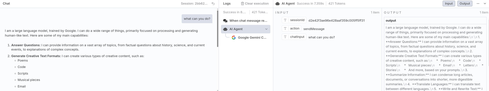

There is a lot going on here, so let's dissect it!  First, right when he hit "Enter/Return" you can see n8n in action in the workflow.  You will see the nodes turn from outlined in gray to outlined in green and receive a green check mark upon completion.  Nodes that are running are visually indicated by a spinning circles over the node.  Hopefully you don't see any nodes turn red, which indicates an error.  Also notice that the workflow tells you how many times each node has run.  In this case, we nee that the chat was received once and the model ran once.

Next, we can see that in the chat window we had returned to us the output of the agent in a nice format, as we would expect.  If you look to the right, we can see important information to the agent, such as the input and the output.  Notice that the input has a few variables.  We see that it has `chatInput`, as we expected from above, which was the thing we asked it.  We can also see that a `sessionId` variable was created.  This is a unique identifier that is used throughout agentic workflows, so it is important to see that it was generated by the chat trigger node.  Finally, we can see the output, which is the response from the AI model.

Now, let's try to ask it "what did I just ask you?"  If you do that, it will likely just repeat the question back to you, having forgotten that you had asked it what it could do before.  This is because the agent has no memory of past interactions yet.  As you likely have guessed, this is what the "Memory" section of the AI Agent node is for.  Click on the "+" symbol next to "Memory" to add memory to the agent.  For this exercise, select "Simple Memory."  This will allow the agent to remember past interactions in the current session.  When we do that, we will see the following:

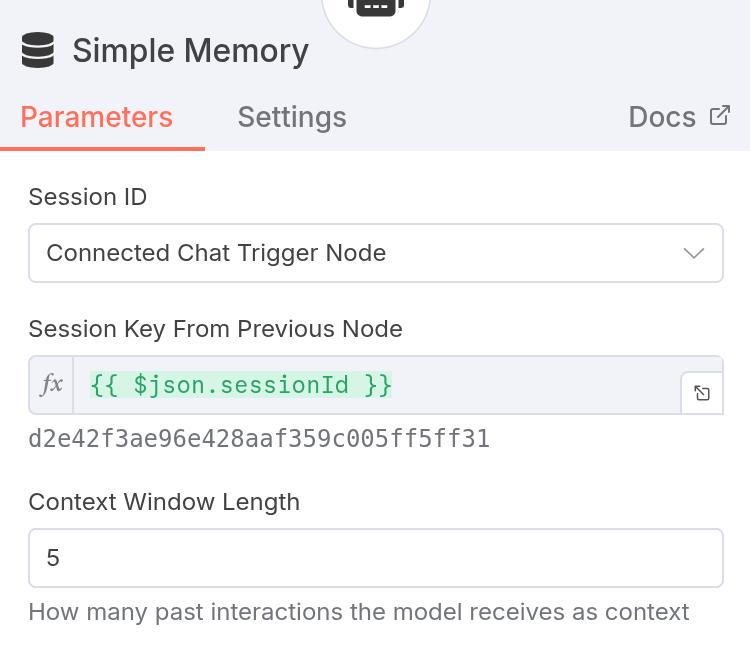

Notice that the memory node requires the `sessionId` variable that we saw earlier.  This is how the memory node knows which session to pull memory from.  Also notice that there is an entry for content length, which defaults to 5.  We can see that this variable name is green, meaning n8n successfully pulled in a value for this variable (shown just below that text) that it though was viable.  This means that the memory is set to remember up to 5 interactions ago (although you can set it to whatever you want within the memory limitations of the n8n cloud environment).  Now, if you return to the chat window, tell it your name, and then ask it "what is my name?"  You should see that it is now able to remember your name from the prior interaction!  Be sure to click on the memory node so you can see what all is being saved there.

We now have a fully-functional chatbot!  Let's start tweaking it a bit through updating the prompts.  Recall from lecture that we have both system prompts and user prompts (n8n calls the prompts "messages").  With what we have right now, we have just dumped whatever you said to the chatbot into the user prompt, which tells the LLM what question you want answered.  However, we might also want to specify some generic behavioral information that we always want the chatbot to always follow.  This is exactly the type of information you want to appear in a system prompt.  To access the system prompt, click on "Options" at the bottom of the AI Agent node and select "System Message."  This will open a text box where you can enter the system prompt.  n8n defaults to a system message of "You are a helpful assistant."  However, let's now change that, as shown below, to "Resond to all things in pirate speak."  Now give it a try in the chat window and observe the results!

We have just completed our first chatbot!  We are now going to work on expanding this chatbot into a more complex workflows in the next activities.

## Module 1, Activity 2: Routing Results to Places Other Than Chat

In the previous activity we created a basic chatbot that interacted with us through the chat window.  However, in many cases we will want to route the results of our agentic workflows to other places.  In this activity we will learn how to do that.

We are going to start with our chatbot from the prior activity.  At this stage, it should look like this:

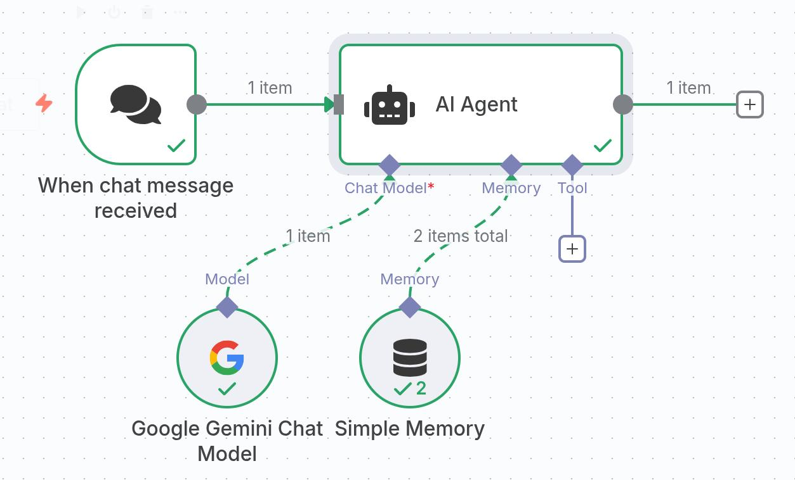

When you look at this workflow, you might notice that plus sign off to the right of the image.  This implies that it is possible to route the output of the agent somewhere other than just back into chat.  In this activity, we are going to do just that.  Our goal is going to create a basic sentiment classifer where the chat agent will take the user's input and then will attempt to determine whether what they said is happy or unhappy.  We will then route that information to a Google Sheet.

### Changing the System Prompt

For the sake of this activity, let's use the following for our system prompt:

```
You are a helpful assistant.

After responding to the user, on a new line, add a sentiment classification in the format: 
SENTIMENT: [happy/unhappy]
   
Classify as "happy" if the user seems satisfied, positive, neutral, or content.  Classify as "unhappy" if the user seems frustrated, negative, or dissatisfied.
```

So basically, this is telling the agent to take its response and append `SENTIMENT` to the end of it along with the word `happy` or `unhappy` based on the sentiment of the user's input.  This type of approach makes it very easy for downstream nodes to parse the output and take action based on it.  Give it a try with some happy and unhappy inputs to see how it works.

### Switch Nodes

So next, we want to use some `if/then` logic to say something like "if the sentiment is happy, do this, else do that."  To do this, we will use a "Switch" node.  Click on the plus sign to the right of the AI Agent node to add a new node.  In the Nodes Panel, search for "Switch" and select the "Switch" node.  This will open the Switch node, where you will see the following:

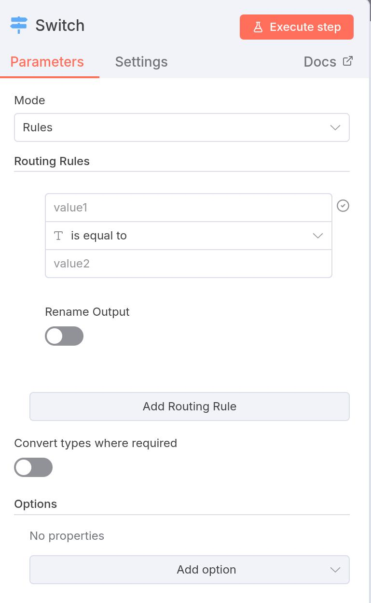

We now need to create our routing rules for the switch.  We know we are going to have two of them: one for happy and one for unhappy.  We also know that the output of the AI Agent node, `$json.output`, should contain `SENTIMENT: happy` or `SENTIMENT: unhappy`.  So we can use that to create our rules as we see here:


Now is a good time to check out that button in the upper right of the node that says "Execute step."  This button allows us to run just this node in isolation, using the output of the prior node as input.  So click that button now to see how the switch is working.  You should see that it successfully routes the output to the correct branch based on the sentiment.  If you gave it a happy input in your last chat, you should see that Output 0 was selected (assuming you used the same order of routing rules as shown above).  If you gave it an unhappy input, you should see that Output 1 was selected.

### Writing Results to Google Sheets

Now let's get those results in real time somewhere that someone could look at them.  We are going to route the results to a Google Sheet for logging purposes.  Start by creating a Google Sheet called "sentiment" with the following columns:

- Timestamp
- Message
- Sentiment

Next we need to add some Google Sheet nodes to each output of the Swtich node.  Click on Output 0 of the Switch node to add a new node.  In the Nodes Panel, search for "Google Sheets" and select the "Google Sheets" node.  You will notice that you are then asked to select one of several different actions:

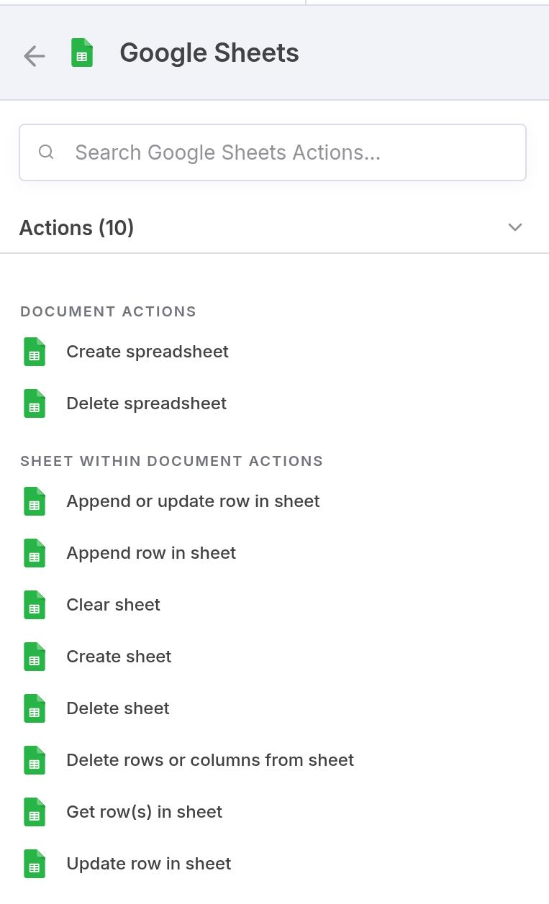

Here, we are going to add a new line to the sheet every time we get a new chat.  So select "Append Row."  This will open the Google Sheets node.  You will use your Google Sheets account as the credential and select "Sheet Within Document" as the resource.  Your operation is "Append Row."  From here, the node will give you drop downs to start filling out to identify which Google Sheet you are editing and which sheet within the spreadsheet you are appending to (just Sheet 1 for us, unless you named the tab something else).  From here, n8n will attempt to manually map each column, which is very helpful because you can just drag and drop the variables you want into each column.  We will use `$now` as the timestamp (i.e. when the chat was sent) and `output` as the Message.  Notice that you can drag these from the input variables to the node on the left.  Finally, we will use a global value for Sentiment.  Since we are starting with Output 0 of the Switch node, we know that the sentiment is happy.  So we can just type in "happy" for that column.  Your completed node should look something like this:


**Note:**
It is also possible to select the Google Sheet by its ID rather than the drop down menu for Document.  The instructions on how to do the are shown in the Module 0 `onboarding.md` document.

Now repeat this process for Output 1 of the Switch node, except this time set the Sentiment column to "unhappy."  

At this point, you have two different append row nodes in your workflow.  While this might not be too confusing with only two of them, note that you can rename nodes in n8n to make it easier to identify them.  To do so, click into the node and double click on the name at the top.  Change the names of your two Google Sheets nodes to something unique so you can easily identify them.  Here is what the completed workflow should look like:

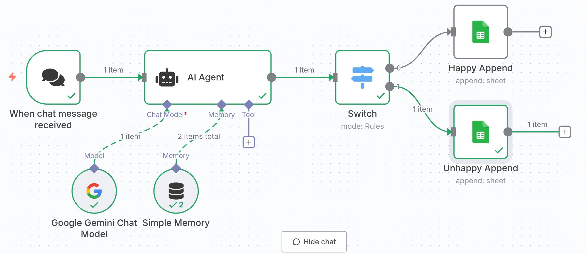

Save your workflow and give it a try!  Enter some happy and unhappy messages into the chat window and then check your Google Sheet to see if the results were logged correctly.  If everything worked, you should see one row in the sheet for each chat you sent, along with the correct sentiment. 

## Module 1, Activity 3: Creating Your First Agent with Tools

When we talk about agentic AI, we are referring to more than just the chatbots we have created so far.  We are talking about giving the LLM tools to perform more complicated tasks than just taking text and responding with text.  So we are going to do just that in this activity.  We are going to power our AI Agent with a tool that goes beyond just whatever is built into the model itself.  (In reality, for this activity we will be using the Wikipedia tool to create a research agent.  Most of the popular LLMs likely already have Wikipedia included in their training data, so this is just for demonstation purposes.  You will be using more sophisticated tools in the challenges.)

For this activity, we are going to create a workflow that will read a list of topics from a Google Sheet.  Then, the AI Agent will use a tool (Wikipedia) to research that that topic and write a short blog post about it.  That blog post will then be written back to the Google Sheet.

### Non-Chat Triggers

All n8n workflows begin with a trigger.  Up until this point that trigger has been the user entering information via the chat prompt.  However, there are several different ways you can trigger your workflow.  Let's start by creating a new workflow and click "Add first step..."  This will show you all of the different types of triggers you can use, as shown below:

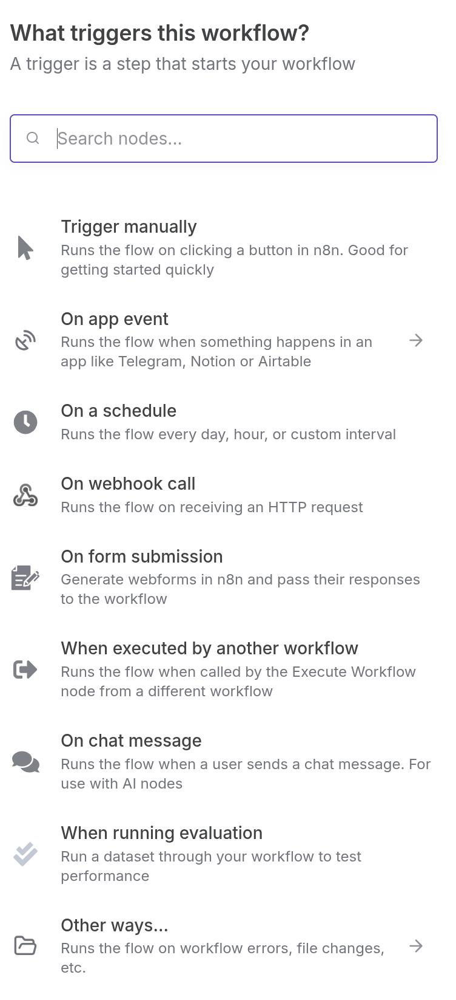

Some common triggers are scheduled triggers (similar to a cron job) or webhooks (beyond the scope of this course).  Let's choose "Trigger manually" for this workflow, which is a great option for testing workflows if you are not using a chat interface.

### Getting the Topics from Google Sheets

We want to create a new Google Sheet that we will read.  You can name it whatever you like, but give it the following columns:

- topic
- blog post

Next, we want to give it a few different topics to research, one per row.  I used Ada Lovelace, Apple Computers, and Barack Obama, but you can use whatever topics you like.  

We now want to read the rows from this Google Sheet by creating a Google Sheet node with the action "Get row(s) in sheet.  As before, you will authenticate using your Google Sheets account and connect to the correct document that you just created (it is likely at the very top of the list since you just accessed it).  Here is what the node parameters looked like in my case:

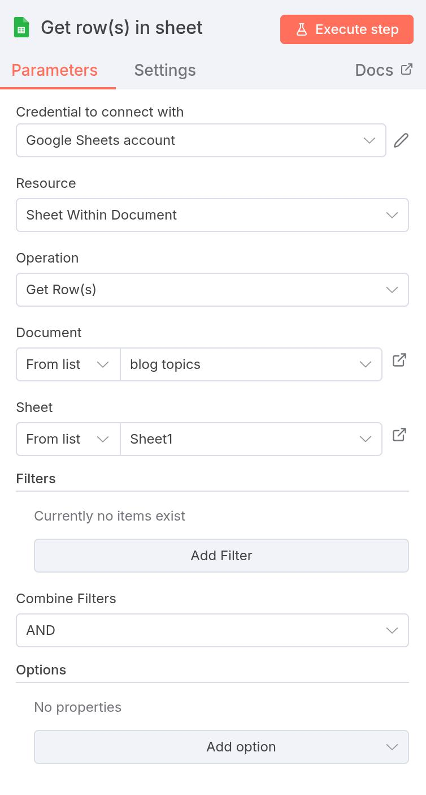

If you execute this step, either by clicking on the "Execute step" button on the node or by returning to the full workflow and clicking the "Play" icon above the node, you will see that 3 items are returned by that node (or the number of topics you created in your sheet).  

### Setting Up the Agent

We now are going to connect the output of that node to our AI Agent node, as before.  However, there are some things that will be a bit different.  Let's see what this looks like:

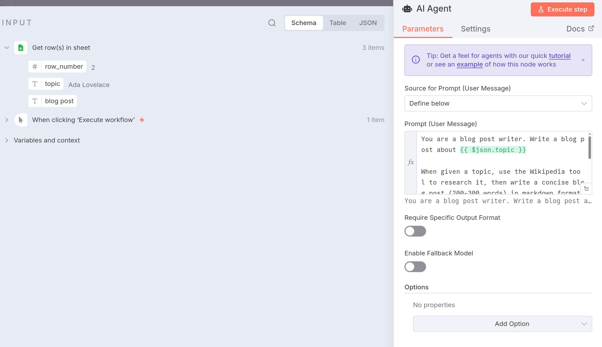

The first thing you might notice is that we have had to change the Source for Prompt (user message).  In our previous activities we had this set to "Connected Chat Trigger Node" since we were taking chat input from the user.  However, this is no longer the case.  So we change this value to "Define below," indicating that there is something more going on here than just chat.  

Next, you can see that we have brought the information we care about into the prompt.  Here is what the full prompt says:

```
You are a blog post writer. Write a blog post about {{ $json.topic }}

When given a topic, use the Wikipedia tool to research it, then write a concise blog post (200-300 words) in markdown format.

The blog post should:
- Have a catchy title (using # heading)
- Include an introduction
- Cover key points from Wikipedia
- Be engaging and informative
- Use proper markdown formatting
```

So in this case the agent is getting the data in the `topic` column from the Google Sheet node and taking action on it based on what is in the prompt.  The agent should loop through each of these topics (since it already knows that there are 3 of them) and generate the blog post for each as described in the prompt.  However, we now want to give it a tool so do that research on each topic.

### Adding Tools

In this activity we will use the Wikipedia tool.  If you click on the "+" below "Tool" on the agent, you will be presented with an extensive list of available tools.  I recommend you scroll through them and see just how many there are!  In fact, you will notice that there are some tools, like Google Sheets, that we have already seen existing as nodes as well!  You should think carefully about when you give your agent access to tools versus using those same things as nodes.  In general, tool use is optional and an agent can have access to several tools.  If you know for certain you want a particular thing to happen in a workflow (such as you know you will always read from and write to Google Sheets), you should use the nodes rather than tools.  What we are about to create is just for demonstration purposes.

Search the tools for the Wikipedia tool, add it to your agent, and run it.  You should see the Wikipedia tool used 3 times (or the number of topics you have in your spreadsheet).  You will also notice that the LLM is called twice as many times (6, in this case).  This is because the topic comes into the model and the LLM has to understand what to do with it.  It then routes the topic to Wikipedia and takes the result back to generate the blog post.  Hence, it is accessing the LLM twice.

It is important to note that the agent knew to access the Wikipedia tool because we told it to do so in the prompt.  However, as you will see shortly, we will eventually need to add tool descriptions to inform the agent what the tool does so it knows which tool to use for the job.  

### A Note on Output Format

We are asking the agent to create the blog post in markdown format.  However, there are many situations where you might want to have a specific structured output from the agent.  In this case, you can tell the agent to "Require Specific Output Format" as shown here:

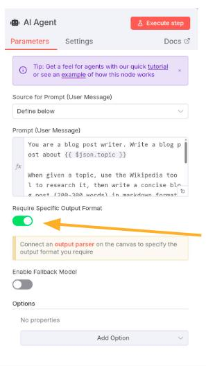

When you do this, you will see that another node connection alled "Output Parser" is added to the agent node:

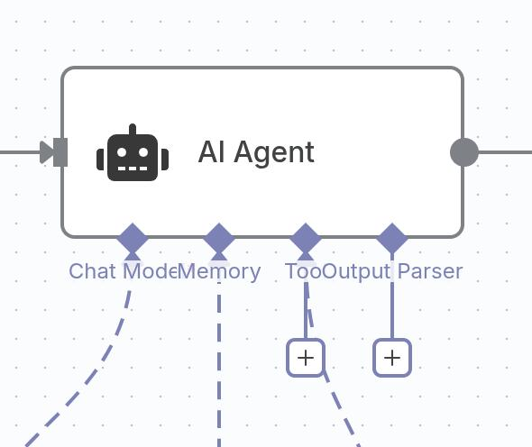

If you click on this, you have the option to either output the results as a list of separate items or as structured JSON.  This might be helpful for you in one of the upcoming challenges!

### Outputting the Results

We now want to write these results back to the sheet.  In this case, we will again create a Google Sheet node, but now we want to just update the rows, not append them.  So choose the approprate action and add the node to the output of the AI Agent.

There are a few things we will need to tell this node beyond what we have used so far.  First, the node needs to know which column to match on.  You can choose either the `topic` or the `row_number`.  I would recommend using `row_number` since you know this value will be unique.  (Think about what might happen if you had two identical topics in your list!)  Next, you will need to tell it what to write to the sheet, as before.  When you have this properly configured, it should look like this:

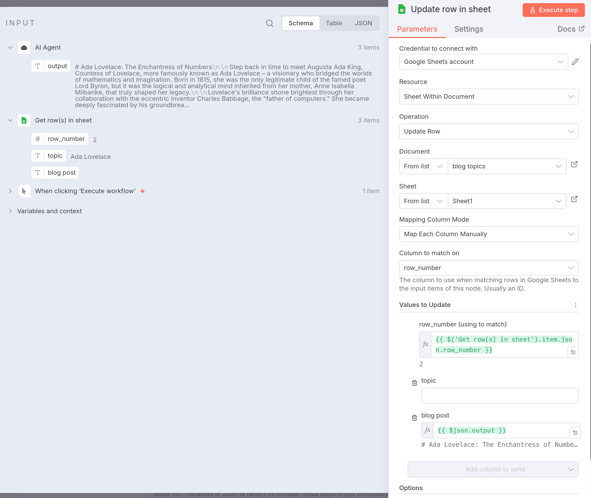

Save and execute your complete workflow and then return to your Google Sheet to make sure it output the blog post to the spreadsheet.  And then try running it again and watch what happens in your Google Sheet.  So just be careful that if you like what the agent generated, you want to make sure you don't overwrite it!

## Module 1, Activity 4: Retrieval-Augmented Generation (RAG)

As described in lecture, RAG is useful when we want to provide our LLM with a lot of information, typically from text, stored as vectors in a database.  In order to do this, we need to provide n8n with the documents to be vectorized, use an LLM to perform the vectorization, and then make that vector database available to a chatbot or other agent.

### n8n Templates

n8n has a large user community that have contributed thousands of templates for a whole host of tasks.  In order to find the templates, go to [https://n8n.io/workflows/](https://n8n.io/workflows/).  These can be directly imported into your n8n cloud workspace or copied as JSON (how all n8n workflows are represented) and then imported that way.

We will be experimenting in this activity with one of those templates.  Search the above webpage for ["RAG Starter Template"](https://n8n.io/workflows/5010-rag-starter-template-using-simple-vector-stores-form-trigger-and-openai/), which will give you a templated called "RAG Starter Template using Simple Vector Stores, Form trigger and OpenAI."  Click "Use for free" and then import it to your n8n cloud environment.  It should look like this:

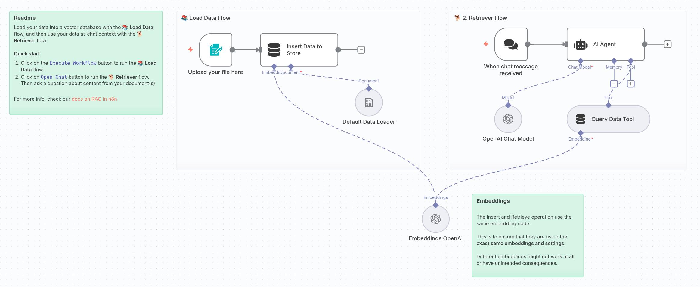

Note that this particular template uses OpenAI embeddings while we have been primarily using Google Gemini.  This is OK.  Click on that node and you will see that you can can claim 100 free OpenAI API credits.  

### Exploring the RAG Chatbot

Let's talk sequentially through what this workflow does before we run it.  First, it is important to realize that there are actually _two_ workflows here.  The first one is labelled here "Load Data Flow."  What it does is take a document, vectorize it, and store it in a vector store.  The main node that does this, called "Insert Data to Store," is a node type called "Simple Vector Store."  Notice that this node type requires both an LLM embedding model (Embeddings OpenAI, in this case), and a document (provided via the Default Data Loader).  

The second workflow is called "Retriever Flow."  Here, we have a second trigger, our usual chat trigger, that is the input to the actual AI Agent.  The agent then uses the Simple Vector Store node called "Query Data Tool" as a tool to the agent to query those vectors created in the first workflow.  Let's actually look at that tool:

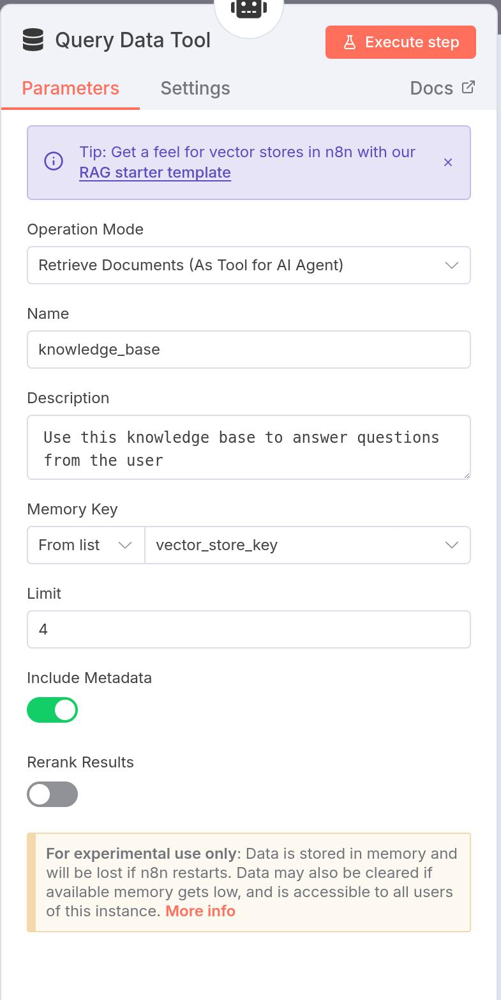

Notice that there is a tool description here that says "Use this knowledge base to answer questions from the user."  This is telling the agent how to use the tool.  (Recall that we did this in the prompt in the Wikipedia example, but it is more robust to add tool descriptions for all of your tools.)  In this case, this tool reads the embeddings of the simple vector store, identifies which chunks of text are most relevant to the user's chat message, and uses that with the LLM to generate a response.

### Running the RAG Worfklow

The first thing we need to do is to upload a file.  If you click on the lightning bolt next to the "Upload your file here" node, this will kick of this first workflow.  In doing so, you will be presented with a window to upload your file.  For this, you will upload the file in this `data/docs/` directory of this repository, which is called `Bill-q2-2025-10-q.pdf`, which is the SEC quarterly filing for Bill Holdings for the 2nd quarter of 2025.  

**Note:** If you get an error when you try to submit this form, save your workflow and try again.

Once it is done running this portion of the workflow, you can see which parts actually ran by observing what turned green.  

Now we can try asking questions of it using the second portion of the worklow, the Retriever Flow.  In the chat window, try asking "What company is described in this Form 10-Q?"  Go through the actual PDF file and find some other questions that you can ask of this chatbot.

## Some Final Notes: 80% of Workflows Rely on a Handful of Common Nodes

We have seen some very basic node usage in this module.  However, it is good to be aware of some of the most useful nodes.  It turns out that 80% of workflows use these nodes at some point:

- Logic nodes/splitting: 
  - [IF](https://docs.n8n.io/integrations/builtin/core-nodes/n8n-nodes-base.if/): route workflows based on true/false conditions
  - [Switch](https://docs.n8n.io/integrations/builtin/core-nodes/n8n-nodes-base.switch/): route workflows (potentially with multiple conditions) based on specific values

- Merge nodes/combining data sources:
  - [Merge](https://docs.n8n.io/integrations/builtin/core-nodes/n8n-nodes-base.merge/): combine data from multiple streams, once data of all streams is available
  - [Aggregate](https://docs.n8n.io/integrations/builtin/core-nodes/n8n-nodes-base.aggregate/): take separate items, or portions of them, and group them together into individual items

- Connectivity:
  - [HTTP Request](https://docs.n8n.io/integrations/builtin/core-nodes/n8n-nodes-base.httprequest/): query data via REST API calls (to be discussed in Module 2)
  - [Webhook](https://docs.n8n.io/integrations/builtin/core-nodes/n8n-nodes-base.webhook/): receive data from apps when an event occurs (beyond the scope of this course)

- [Code node](https://docs.n8n.io/integrations/builtin/core-nodes/n8n-nodes-base.code/): write custom JavaScript or Python and run it as a step in the workflow

## Conclusion

You have now successfully completed all activities of this first module!  You are now ready to begin solving the graded challenge problems located in `./Module_1/Challenges.md`.


