# Module 2 Activities: Agentic Patterns, Custom API Integration, and Extraction

In this module we will work more with tools and agentic workflows, bringing in the very power HTTP Request node for making calls to REST APIs.

## Module 2, Activity 1: A Very Basic HTTP Request

We will begin with a trivial workflow that is designed to send a GET request to a REST API endpoint.  This particular endpoint will require no authentication or credentials and just return a basic JSON payload.

So let's start with a manual trigger and add to it an "HTTP Request" node, as shown in this workflow:

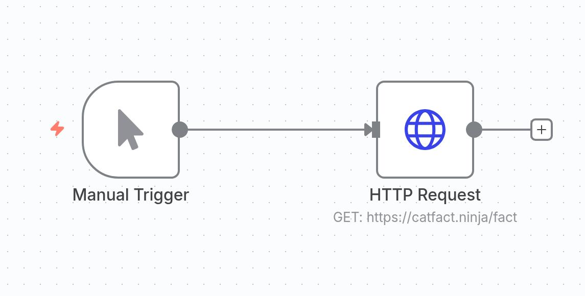

When you add the HTTP Request node, n8n will bring up the following screen:

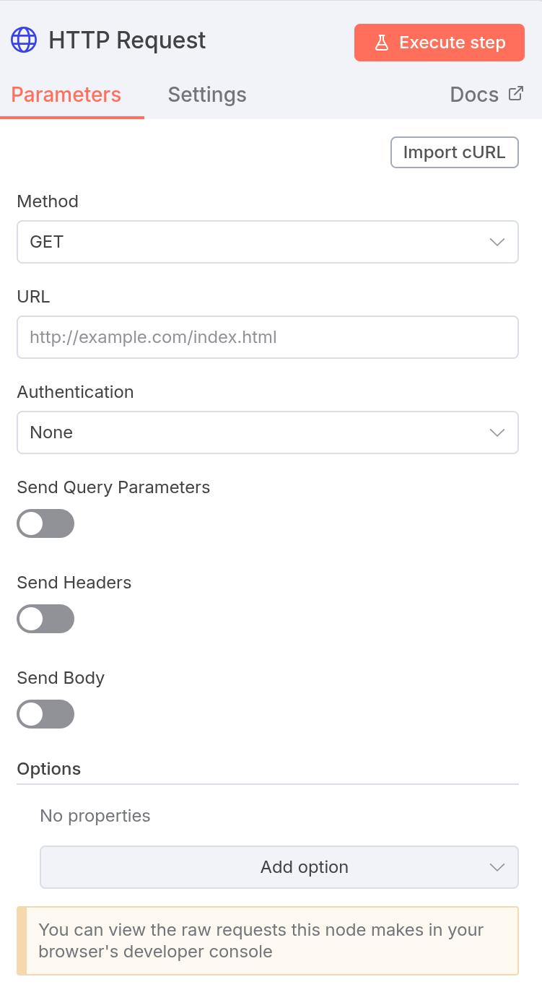

Right now we are going to keep this as simple as possible.  So we just need a URL for our GET request.  Let's use `https://catfact.ninja/fact`.  If you put that in the URL box and click the red "Execute step" button, you will see the returned payload.  It varies each time you execute the request, but (in JSON format) the output should look something like this:

```json

[
    {
        "fact": "At 4 weeks, it is important to play with kittens so that they do not develope a fear of people.",
        "length": 95
    }
]
```

Congratulations!  You have just made your first API request from n8n!

## Module 2, Activity 2: HTTP Requests as a Tool

Now we are going to make this a little more complicated.  We are going to create a weather chatbot that will use the HTTP Request as a tool rather than a separate node.  For this activity, you will need to create an API key from Visual Crossing as described in the onboarding document.

### Create The Workflow

We are going to begin by creating a basic chatbot workflow like we did in Module 1.  It should look like this:


We are now going to populate this step by step.

First, let's configure the agent.  We want to update the system message a bit to provide some basic instructions.  Our goal will be for the agent to read from the user's message what location they are referring to and then go get the current weather for that location.  Provide the following to the system message:

```
You are a helpful weather assistant. When a user asks about weather for a location, use the Get Current Weather tool to fetch the current conditions. Extract the location from the user's message and format it appropriately (e.g., "Denver,CO" or "London,UK"). Present the weather information in a friendly, conversational way.
```

It is important that we have included in the system prompt examples of how to format the data since the Visual Crossing API has requirements of no space in between the city and state/country.  Providing examples of behavior you want is called **few-shot prompting** and is a very good habit to adopt!

### Configure the HTTP Request Tool

Let's start at the top of the tool, as shown here:

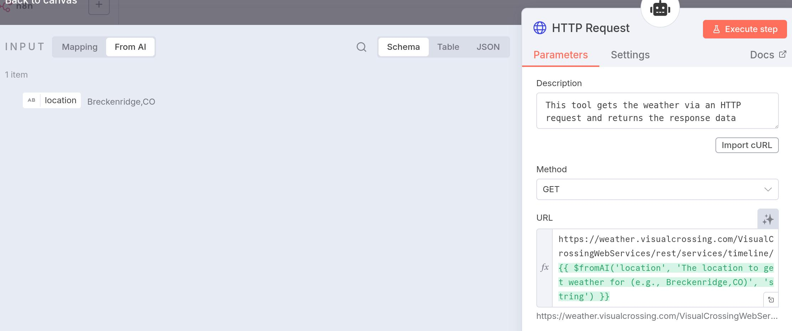

Notice that we start with a tool description, which tells the agent what this particular tool does.  Keep these descriptive but concise.  Next, we see that we are using the GET method.  After that, we pass it a URL.  This is where things get a little complicated.  We need to get the location from the agent.  If we were to run the bot and look at the input panel on the left in the "From AI" section, we can see that the agent populated a variable called "location."  It is used to populate the URL.  However, there is a bit of code being used here to do so, namely:

```
{{ $fromAI('location', 'The location to get weather for (e.g., Breckenridge,CO)', 'string') }}
```

`$fromAI()` is a special function used when the HTTP Request node is connected as a tool to an AI agent.  It tells the agent that it needs to supply this value when calling the tool.  `location` is the parameter name that the AI will reference internally.  `The location to get weather for (e.g., Breckenridge,CO)` is a description that helps the AI understand what value it should provide.  This acts as instructions for the agent.  Finally, `string` specifies the data type the AI should return.

Let's dive a bit deeper into the next part of the HTTP Request configuration by considering what the URL would look like if we wanted to cURL this information.  If I wanted to get the weather for my home town of Breckenridge, CO, I would use the following URL:

```
https://weather.visualcrossing.com/VisualCrossingWebServices/rest/services/timeline/breckenridge%2C%20co?unitGroup=us&key=SUYJUM8ETPPD2BAXGRHDX23M5&contentType=json&include=current
```

Let's briefly review REST API's and what this actually means.  We start with the base URL, which, in this case, is:

```
https://weather.visualcrossing.com/VisualCrossingWebServices/rest/services/timeline/breckenridge%2C%20co
```

From here, the `?` indicates that query parameters are now coming.  `&` signals the start of a new query parameter.  So we have a query parameter called `unitGroup` which has a value of `us`.  We also have our `key` passed right in the URL along with `contentType`.  `include=current` tells this particular API to be sure to include the current measurement in addition to the historical ones.  We will use all of these (except `contentType`, which is defaulted) in our HTTP Request Tool.

So let's scroll down in that node to see what else we can configure.  Here is what we see:

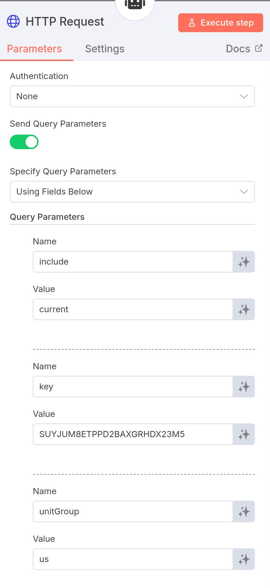

First, we have authentication set to none.  In general, it is best practice to save authentication information in credentials.  However, in this simple case we can see from the URL that the `key` is passed as a query example, so we will start with this approach.  We turn on "Send Query Parameters" and then set each of them by their name and value.  

Once this is configured, you are now ready to run this basic chatbot.  Ask what the weather is like in your home town and watch it at work!

###  Setting the Credentials Outside of Query Parameters

As stated above, it is generally preferrable to set the credentials outside of the workflow itself in the credential manager.  So let's adjust the above workflow and do that.

Let's start by detaching that HTTP Request Tool from the workflow by hitting the trash icon on the arrow connecting the agent to the tool.  Next, create a new HTTP Request Tool and copy in the values for the description in URL from the original one.  

Now, we are going to add authentication.  We know that this particular API wants Query Authentication since the URL was taking it as a query parameter.  So choose "Generic Credential Type" from the dropdown as shown:

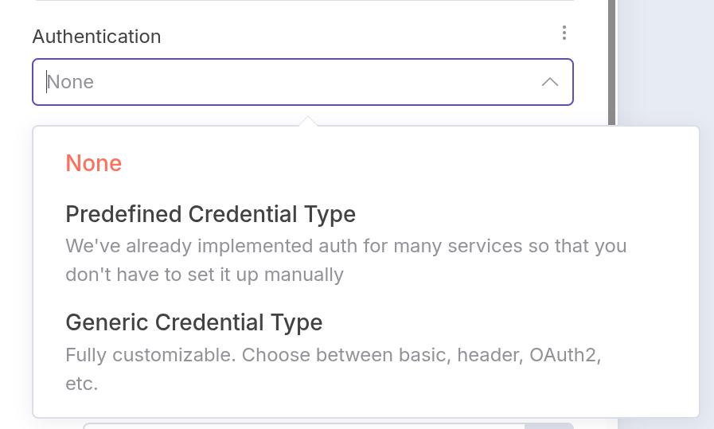

Next, select "Query Auth" from the dropdown:

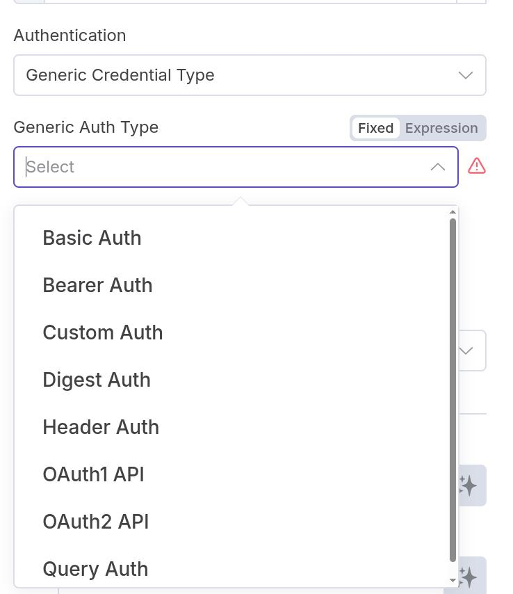

Then, it will ask you to select which Query Auth you would like to choose, which lists any available from your credentials.  We will be creating a new one, so select "Create new credential."  Here you will get the following screen:

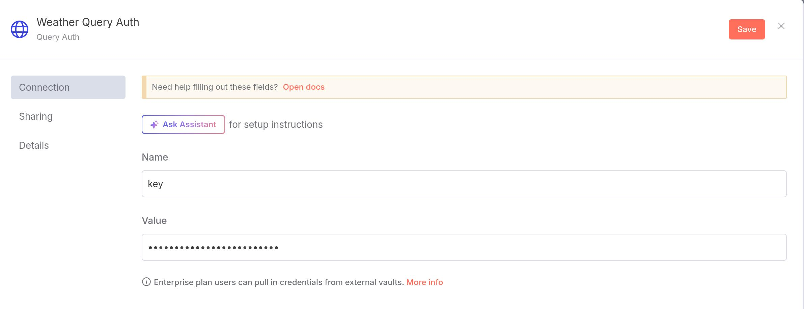

Be sure to give this credential a unique name ("Weather Query Auth" in this case).  Then, we know it wants the query parameter called `key` and we copy the actual value of that key into the box.  Then hit save, which saves it to your credentials, allowing you to use it for all future workflows.

Wire this new tool into your workflow and confirm it works as before.

## Module 2, Activity 3: HTTP Requests with More Sophisticated Authentication

In this activity we will create a more sophisticated agents that uses both POST and GET requests to query some staged data in a Bill.com Sandbox account with the v3 API, all from within n8n.  While what we will show in this activity is just how to authenticate and get some very basic information from the Sandbox, you will build off of this activity in the challenge problems for this module to do more sophisiticated things.

### Understanding how Bill's API Authentication Works

As you will discover in this activity, there are two key steps in getting information from a Bill.com Sandbox.  First, you need to authenticate via a POST request to get a `sessionId`.  Then, you use that ID in the header of all subsequent GET requests to get information from the API.  This means that you will have to use two different HTTP Request nodes in your workflow since a single HTTP Request node can only be configured for one type of request at a time.

### POST Request for Authentication

Lets start by creating a new workflow with a Manual Trigger and an HTTP Request node.  Connect the two nodes together.  This will bring up the configuration screen for the HTTP Request node.  We will set the method for this node to POST since we are authenticating.  Next, we need to set the URL to the authentication endpoint for Bill.com's v3 API, which is `https://gateway.stage.bill.com/connect/v3/login`.  

We now need to provide our authentication information.  Since Bill.com does not have a built-in credential type in n8n, we will use the "Generic Credential Type."  It is important to note that there are 4 keys that we must provide values for in order to authenticate, namely `username`, `password`, `organizationId`, and `devKey`.  The values for these will be provided to you in class.  However, if you look through each of the generic auth types, there isn't one that will allow you to provide that many key-value pairs.  Therefore, we will be creating a "Custom Auth" type of credential by selecting that from the "Generic Auth Type" dropdown.  Next, select "Create new credential" from the "Custom Auth" dropdown.  This will bring up the following screen:

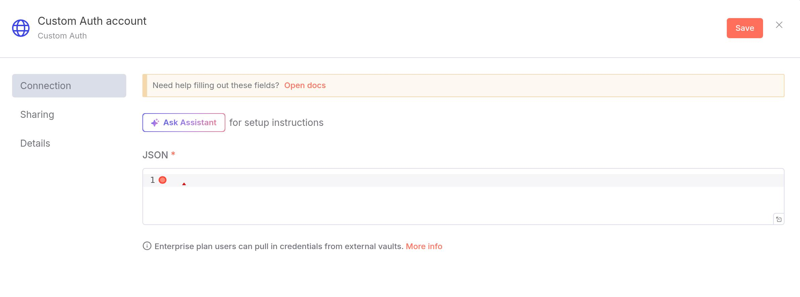

Here, we will populate the JSON field with the key-value pairs needed.  At this point, you are strongly encouraged to consulte the [Custom Auth documentation](https://docs.n8n.io/integrations/builtin/credentials/httprequest/#using-custom-auth) to see what format to use for this.  You will note that the "Body" type authentication is what we will be using since the v3 API expects the authentication information to be passed in the body of the POST request.  In particular, we observe that since we re passing these values as JSON in the body, we need a key called `body` and then provide JSON with the key-value pairs needed for authentication.  Here is what the JSON should look like once you have populated it with your own values:

```json
{
  "body": {
    "username": "sullivanclair099@gmail.com",
    "password": "...provided in class...",
    "organizationId": "...provided in class...",
    "devKey": "...provided in class..."
  }
}
```

Once we have created this credential, we send it in the body of the HTTP request by selecting that option and specifying that the body content type is JSON, as shown here:

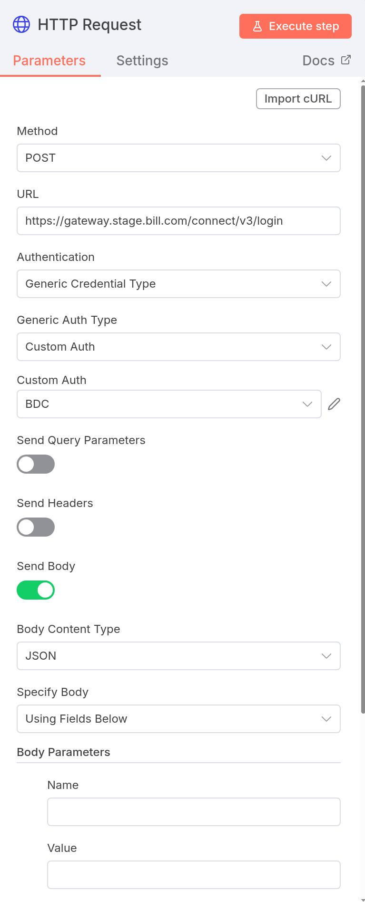

(We don't have any additional body parameters that we are manually sending at this point, so we can leave those blank.)  If you click the red "Execute step" button, you should see a successful authentication response that includes a `sessionId`.  The `sessionId` does expire after a few minutes, so you might find yourself having to manually execute this node from time to time as you work through the rest of this activity.

We now will connect this node to an AI Agent node (don't forget to set "Source for Prmopt" as "Define below" since we are not creating a chatbot at this time) with Google Gemini as the chat model, like before.  You can use the following prompt for the user message for this activity:

```
Analyze the following vendor data and provide a summary.

Please provide in markdown format:

- Total number of vendors
- A listing of all vendor names, email addresses, and phone numbers
- The balance for each vendor
```

### GET Request for Vendor Data

We now need to give the agent access to the Sandbox as a tool to do its work.  So we will create another HTTP Request node and connect it as a tool to the agent.  This time, we will set the method to GET since we are retrieving data.  The URL for getting vendor data from the v3 API is `https://gateway.stage.bill.com/connect/v3/vendors` since we are retrieving vendor data.  You can use the following for the tool description:

```
Makes an HTTP request to the Bill API to get vendor information and returns the response data
```

The URL for vendor GET requests is `https://gateway.stage.bill.com/connect/v3/vendors`.

Remember in the previous login step we sent the authenthication in the body? The vendor GET request expects something different.  It expects the `sessionId` and `devKey` key-value pairs to be in the header.  We could just hardcode the information in as a header parameter, but a better option is to create a header credential that we can reuse.  So select "Generic Credential Type" from the "Authentication" dropdown and then "Header Auth" from the "Generic Auth Type" dropdown.  Next, select "Create new credential" from the "Header Auth" dropdown.  For this, you will set the Name to `devKey` and the Value to the devKey provided in class. 

As for `sessionId`, we cannot set it this way since it is dynamically created.  So we do need to manually provide it in the node as a header parameter.  However, rememver that it was determined earlier in the workflow by the first HTTP request node.  So we can use the value `{{ $json.sessionId }}` (just drag it from the input variable list on the left panel) to bring it in.  So you configuration for this HTTP Request tool should look like this:


and your complete workflow should look like this:

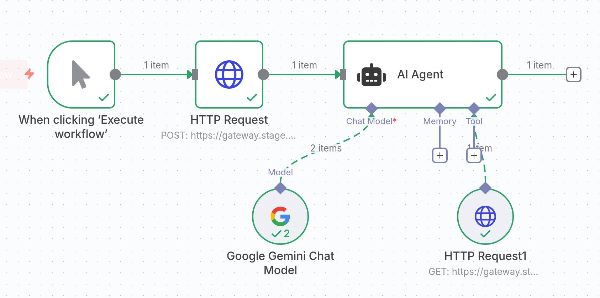

If you execute this workflow, you should get the output in the lower right panel showing the vendor data in this Sandbox.  

## Module 2, Activity 4a: Extraction of PDF files

We are now going to change gears a bit to a common use case for agentic workflows, namely extraction of data from documents.  In this activity, we will extract text from a PDF file using n8n's "Extract from File" node.

We will get started with a different type of trigger than we have been using so far.  Instead of using a manual or chat trigger, we will use "On form submission."  This trigger allows the user to upload a file via a new browser window.  We will set this up as shown below:

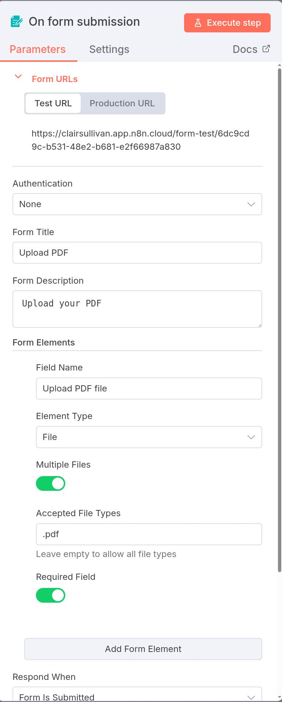

We can see here that we are set up to accept only PDF files in this form, but you can change this to be a comma-separated list of file types if you want to accept more than just PDFs.  Also note that the output field, based on what is set here, will be called `Upload_PDF_file` (note the underscore in place of spaces).  You will need this information for the next node.

Next, we are going to connect this to an "Extract from File" node.  This node is very powerful and can extract text from a variety of file types, including PDFs, HTML, CSV, JSON, and more.  We will select "Extract from PDF" as our operation and the input binary field is set to the file that was uploaded in the previous step, namely `Upload_PDF_file`.  Here is what the configuration looks like:

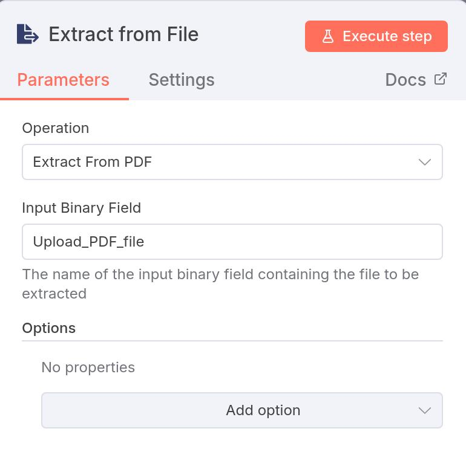

We then will connect the output of this node to our AI agent (with Google Gemini as the chat model) to analyze the extracted text.  Here is the prompt we will use for this activity:

```
Summarize the following resume:

 {{ $json.text }}
 ```

In other words, the output of the "Extract from File" node was ``$json.text``, which we are passing to the agent for analysis by directly placing it into the prompt.  You completed workflow should look like this:

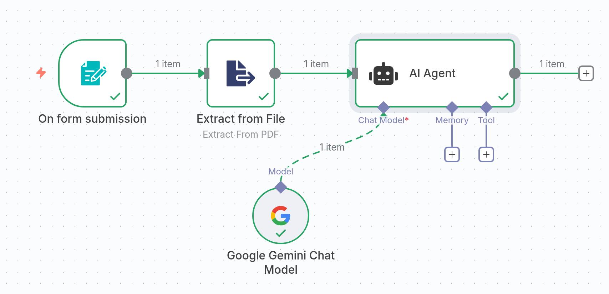

Let's now run this workflow.  For the purposes of this activity, we will be using the PDF file called `emily_zhang_resume.pdf` in this repository located in `/docs/resumes/`.  Hopefully, you get a nice summary of Emily's resume from the agent!

## Module 2, Activity 4b: Using the HTTP Request for Extraction

