# Module 3 Activities: LLM Evaluations with Braintrust and n8n

In this module we will look at how to do evaluations of LLM outputs using Braintrust.  We will first set up Braintrust in preparation for doing evaluations.  Then we will create an n8n workflow that uses Braintrust to evaluate the output of our agentic workflows.

## Module 3, Activity 1: Setting up Braintrust

You will have received information in the onboarding document about setting up Braintrust.  If you have not done so already, please follow those instructions to set up your Braintrust account.  Once you have an account, go to [the Braintrust dashboard for the course](https://www.braintrust.dev/app/BILLWORKSHOP).  

The first thing you will need to do is to create a new project, by clicking on the blue "+ Project" button, as shown below:

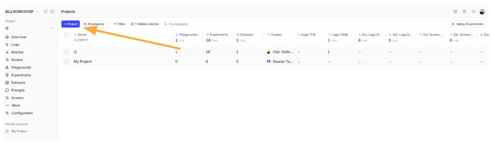

Give your project a name like your username.  This is where you will store all of your work on Braintrust for this course.

### Creating a Dataset

We will begin by creating a simple, 3-question dataset for evaluating a very simple chatbot.  The notional purpose of this chatbot is simple question answering on general knowledge.  So we want to create some question-answer pairs in the dataset that reflect that.  Let's start by creating a new dataset by clicking on the blue "+ Dataset" button, as shown below:

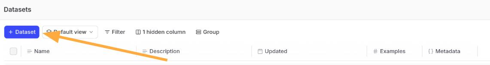

We will now choose to manually create a row in this dataset.  Click on the "..." next to the dataset name and give it a different name like "Chatbot dataset" and then clock on the "+ Row" button at the right to add a row, as shown below:

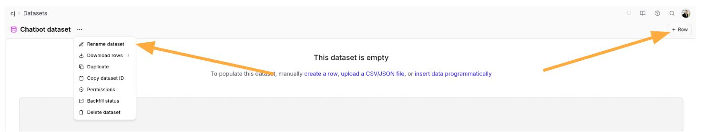

This should then pull up a panel on the right to edit the dataset row.  We want to be sure to provide both the input and the expected output that we would want the chatbot to answer.  Here is an example of what that looks like:

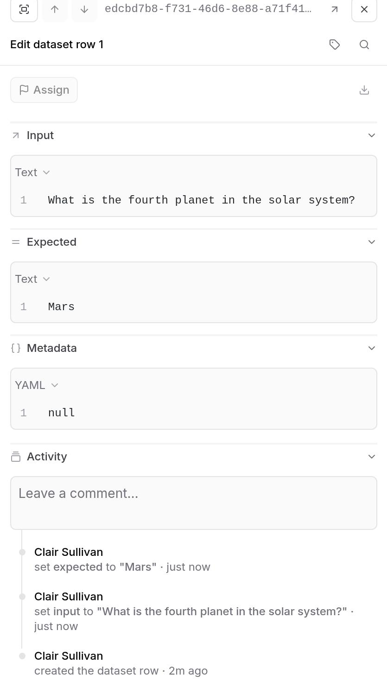

Create 2 more similar questions on your own with the "+ Row" button.  Here is what mine looked like:

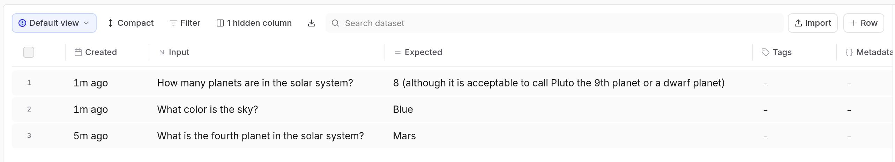

Notice that after you have created a few question-answer pairs, Braintrust will have learned what types of questions you are asking and it can use and LLM called Loop to create more rather than you having to generate them all yourself.  This is very handy as you try to build out a larger dataset.  In order to access Loop to do this after you have manually entered a few pairs, hold your mouse over the "+ Row" button and you will see an option to "Generate 5 rows," as shown below:


Do this now to create a total of 8 question-answer pairs in your dataset.  You will need to click the orange "Confirm" button in the lower right to generate them and then the blue "Accept" button once you have had a chance to review them before adding them to your dataset.  You can always edit any of them later if you want to change them.

You now have enough set up in Braintrust to connect it to n8n and get evaluating!

## Module 3, Activity 2: Creating an n8n Workflow to use Braintrust for Evaluations

n8n does not have a built-in Braintrust node, so we will use the HTTP Request node to connect to the Braintrust API.  Start by creating a new workflow in n8n with a Manual Trigger node.  From here, we want to set some global variables using an Edit Fields node.  In particular, we want to set the variables for `project_name` and `dataset_name` to reflect what we created in Braintrust.  In my case, I set them as follows:

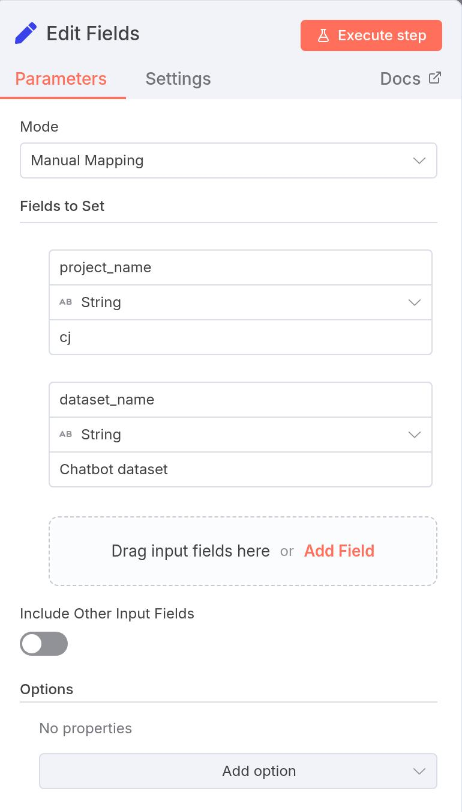

Next, we will add an HTTP Request node to get the dataset ID from Braintrust based on the dataset name.  In order for this to work, you will need an API key for Braintrust.  To get one, go into Braintrust and click on your avatar in the upper right and select "Settings" from the dropdown.  Then click on the "API Keys" tab on the left.  Here you can create a new API key for n8n to use.  Be sure to copy the key value as you will need it in n8n.


Now we need to configure this new HTTP Request node.  The purpose of this node is to get the dataset ID, which will be used in subsequent calls to Braintrust.  Here is how I configured this node:

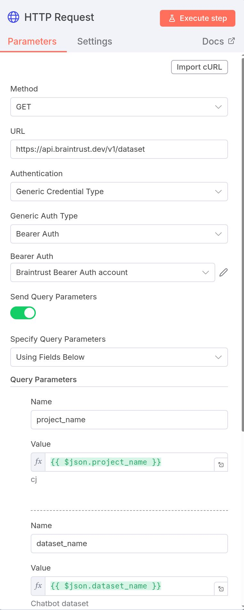

As before when we have created HTTP Request nodes requiring authentication, we will use a generic credential type.  For APIs that have just an API key, this is a "Bearer Auth."  As you have in previous activities, you can create a new credential from here for this API key.  Be sure to give it a unique name like "Braintrust Bearer Auth account" so you can reuse it.

Also notice that we will be sending some query parameters, namely the `project_name` and `dataset_name` that we set in the Edit Fields node.  This will allow Braintrust to find the correct dataset and return its ID.  At this point, click the red "Execute step" button to test this node.  If all goes well, you should get an output including variables like `id`, `project_id`, etc.  The `id` variable is the dataset ID that we will need for the next step.  To make it easier to use later, we will add another Edit Fields node to extract just the dataset ID into a variable called `dataset_id`, as shown below:

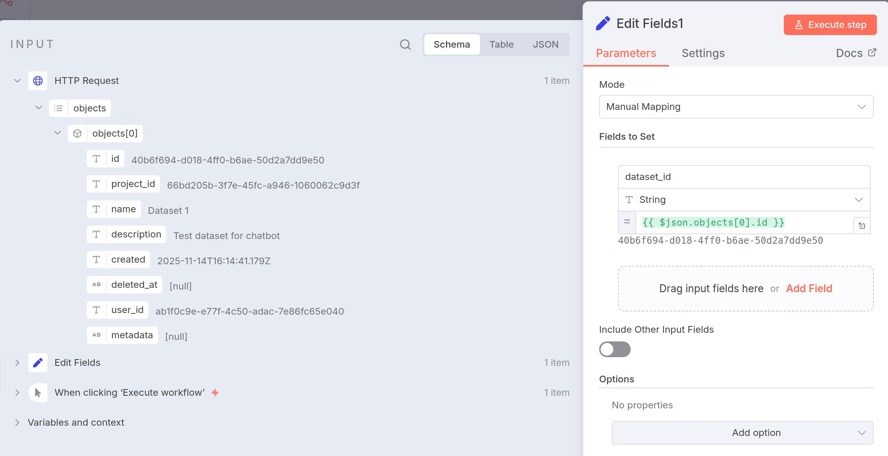

### Bringing in the Question-Answer Pairs to n8n

Now that we have everything set up and have successfully retrieved the dataset ID from Braintrust, we can now bring in the question-answer pairs to n8n.  We will do this using another HTTP Request node.  Here is how I configured this node:

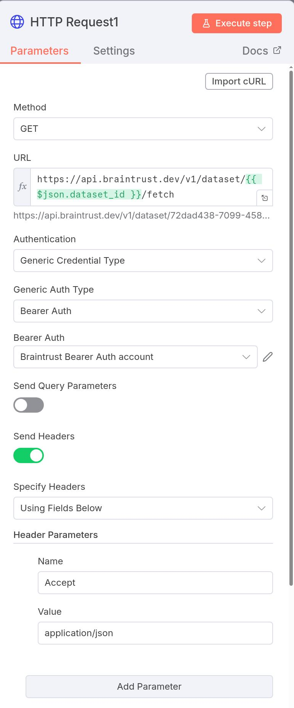

Let's look at this section by section.  First, we are using the GET method to retrieve data from Braintrust.  The URL is constructed using the dataset ID that we retrieved in the prior step.  Again, we are using the same Bearer Auth credential we created earlier for authentication.

Next you will notice that we are sending headers with this API request.  Headers are metadata you send with the HTTP request.  They communicate important information to the server about how you want the request handled and what format you expect back.  In this case, the "Accept" header tells the Braintrust API "Please send me the response in JSON format."  It's saying that your client (n8n) is prepared to handle and parse JSON data.  Without this, the server might send data in a different format, which could cause issues downstream in your workflow.

If you execute this step, you should see an array of `events` returned.  In fact, there are 8 elements in this array, corresponding to each of the 8 question-answer pairs we created in Braintrust.  Each element has a number of fields, but the ones we care about are `input` and `expected`, which correspond to the question and answer, respectively.

### Handling the `events` Array

In order to process each of the question-answer pairs, we need to handle the `events` array returned by the previous HTTP Request node.  We can do this using a Split Out node.  This node will take an array and split it into individual items that can be processed one at a time.  Here is how to configure this node to take the `events` array from the previous node:

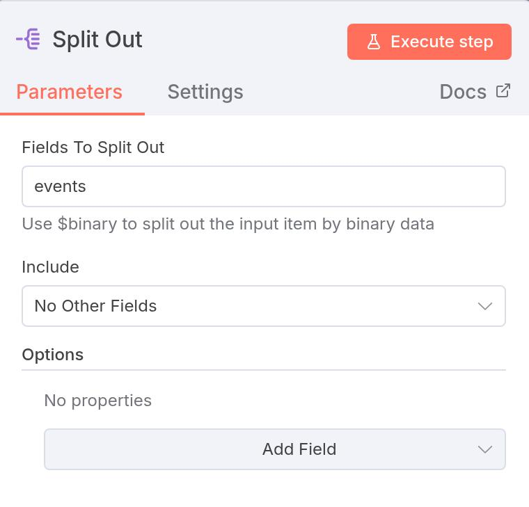

Let's now look at what we have so far for our workflow:


As we can see above, we can quickly verify that the Split Out node is working correctly by executing it.  We can see that we started with 1 item being passed between each node, but by the final Split Out node we now have 8 separate items, one for each question-answer pair.  We can now connect this to our agent.

### Connecting to the Agent

As before, connect your AI Agent node to the Split Out node along with your chat model.  We want the agent to respond to the question provided in the `input` field of each item.  We can do this by setting the prompt to strictly be:

```
{{ $json.input }}
```

This is essentially mimicking how a human would ask a question to a chatbot, but in an automated fashion from our 8 individual questions (`input`).  If you run this node, it will take a moment as it turns through all 8 of the questions.  But you should see the output of the AI Agent node now has 8 items, each with the agent's response to the corresponding question.

### Logging this Output Back to Braintrust for Evaluation

If you read the Braintrust documentation you will discover that Braintrust has a very specific format for logging data for evaluation.  In particular, in order to log an experiment, Braintrust requires values for `input`, `output`, and `expected`.  However, these are attached to different nodes throughout our workflow, such as `{{ $('Split Out').item.json.input }}`.  So we want to make sure that they are renamed to the variable names that Braintrust   We will use another Edit Fields node to set the variable names and correct format as shown below:

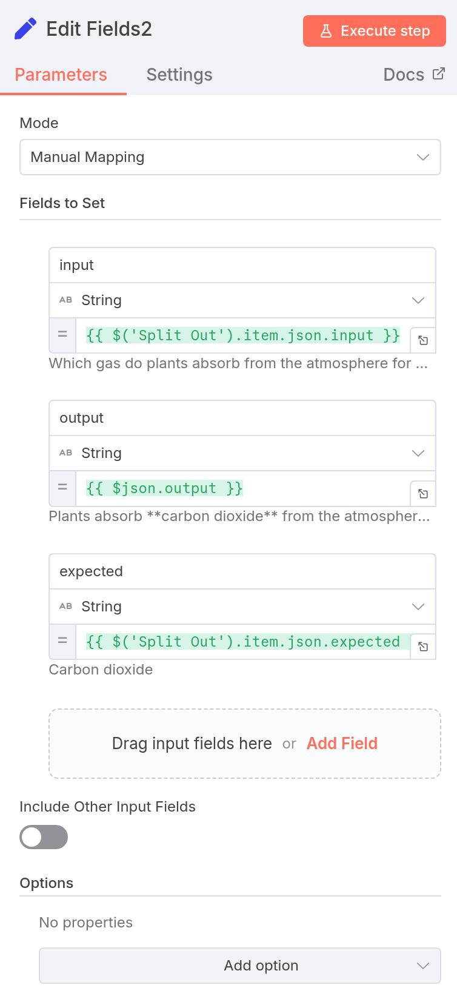

Next, we need to know that Braintrust expects these values as a single list.  To create this list from our existing 8 items, we will use an Aggregate node where we combine all item data from the previous node into a single list.  Here is how to configure this node:

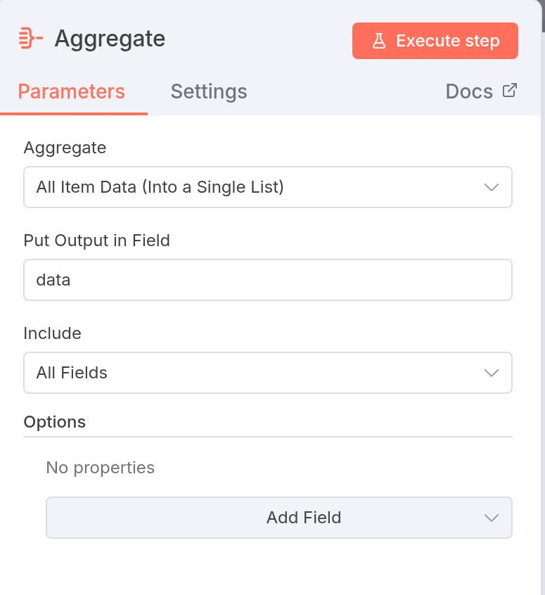

Notice that when you run this node, you have a nicely-formatted list and the output of the node is now back to a single item.

### POSTing the Results to Braintrust

We finally are ready to POST these results back to Braintrust as an experiment for evaluation.  We will use two more HTTP Request nodes to do this.  The first one will create the experiment and the second one will log the results to that experiment.  Here is how to configure the first HTTP Request node to create the experiment (note that the image is split into two parts for readability):

<div style="display: flex; gap: 20px;">
  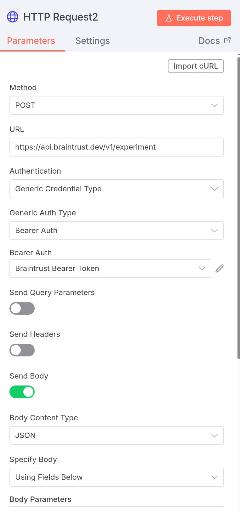
  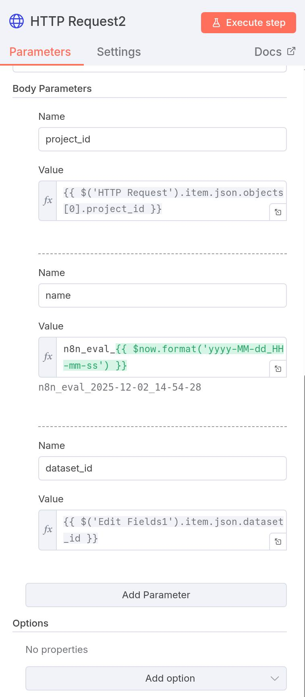
</div>


Let's look talk about what is going on here.  Since this is a POST request, you need to send a body (the actual data) with the request.  This is configured as JSON, which is the standard format for APIs.  The body contains three parameters that define the new experiment:

- `project_id`: The expression {{ $('HTTP Request').item.json.objects[0].project_id }} retrieves the project ID from the first HTTP Request node. This tells Braintrust which project the experiment belongs to.
- `name`: This uses n8n_eval_{{ $now.format('yyyy-MM-dd_HH-mm-ss') }} to dynamically generate a unique experiment name.  It is generally good practice to provide a unique name and including a time stamp is a nice, quick way of knowing when the experiment was run.  The `$now` function gets the current timestamp and formats it as a date with time.  So each time this workflow runs, it creates a name like "n8n_eval_2025-12-02_14-54-28".  
- `dataset_id`

 At this point, if you go into the Experiments tab in Braintrust and run this node, you should see a new experiment created with the name you specified and current time stamp.

 Now comes the final step of actually writing the results to this experiment.  Here is how to configure the final HTTP Request node to do this:

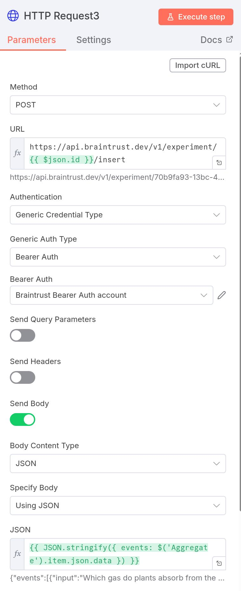

Breaking this down, the POST method sends data to the Braintrust API.  Notice the URL is `https://api.braintrust.dev/v1/experiment/{{ $json.id }}/insert`, which uses the experiment ID from the previous request.  This tells Braintrust which experiment should receive the new data.

Because we are using a POST request we know we need to send a JSON body with the request.  This is where things get interesting.  Here we are sending straight JSON with the "Using JSON" body specification and then we use `{{ JSON.stringify({ events: $('Aggregate').item.json.data }) }}` to create that content.  This is doing two things.  First, it's creating a JavaScript object structure with an "events" key that contains the data from the Aggregate node.  The expression `$('Aggregate').item.json.data` pulls the processed results from your AI agent output stored in the Aggregate node.  Second, `JSON.stringify()` is a critical function here.  It converts that JavaScript object into a properly formatted JSON string. Think of it this way: inside n8n, the data exists as a JavaScript object (which is flexible and mutable), but when you send it over HTTP to the API, it needs to be in JSON format (which is a text based string representation).

Once you execute this node, you will see a series of unique identifiers returned, one for each of the 8 question-answer pairs that were logged to Braintrust.

So now we have a complete workflow that takes question-answer pairs from Braintrust, has our AI agent answer the questions, and then logs the results back to Braintrust for evaluation.  Here is what the complete workflow looks like:

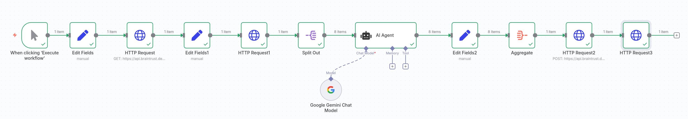

### Examining the Results in Braintrust

Now that we have logged our experiment results to Braintrust, let's go back to the Braintrust dashboard and see how our AI agent performed.  Go to the Experiments tab and you should see the experiment you created earlier, likely labeled as "LATEST."  Click on it to see the details.  Here is what mine looked like:

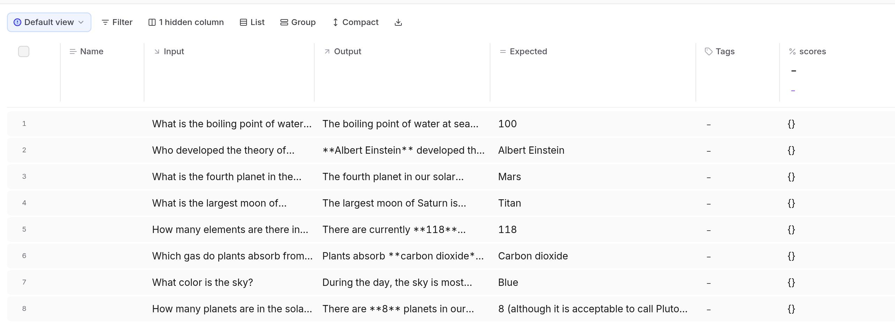

So we can see what the input question was (`Input`), what the output of the agent was (`Output`), and what the expected answer was (`Expected`).  Congratulations!  You have successfully logged your first experiment to Braintrust from n8n!

## Module 3, Activity 3: Scoring the Results with Braintrust

While it is useful to look at the exact response of the agent to each question, as the number of question-answer pairs increases this is not always practical.  Additionally, it is useful to have an overall score for how well the agent performed for monitoring behavior over time or with specific changes to your workflow.  Braintrust provides a way to do this using their scoring feature.  Let's look at how to set this up.

In Braintrust select "Scorers" and create a new scorer by clicking on the blue "+ Scorer" button.  

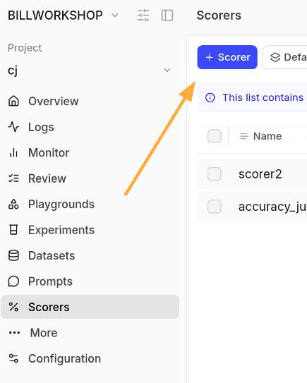

Let's give it the name of "accuracy_scorer".  We will be using the LLM as a judge and you will be able to choose from a variety of LLMs to handle the scoring.  For this example I will use GPT-5 mini.  Next, you need to provide a system prompt that can take the input, output, and expected values and return a score.  Here is an example of a simple prompt that does this:

```
Consider the following question:
{{input}}

and answer:
{{output}}

Does the answer satisfy the expected answer? {{expected}}

a) It perfectly answers the question.
b) It partially answers the question.
c) It is completely wrong.
```

Notice that this scorer has 3 potential outcomes such that there is a non-binary scoring of the agent's response.  This is a useful choice to allow for partial credit, but you could also make this a binary correct/incorrect scorer if you wanted to.

Finally, we need to assign what score to award to a, b, and c above.  I chose 1 for a, 0.5 for b, and 0 for c.  Here is what the completed scorer looks like:

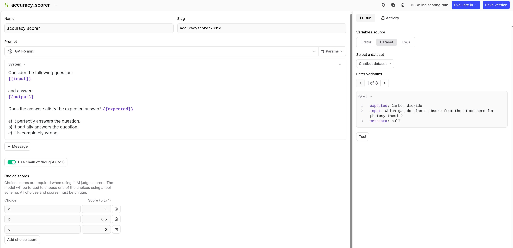

Save this scorer so we can run it on our experiment.

### Running the Scorer on the Experiment

Go back to the Experiments tab and select the experiment you created earlier.  From here, you will want to select all of the questions you want scored.  (Select all of them.)  Next, click the "% Score" button above the dataset to select a scorer to apply to these questions.  

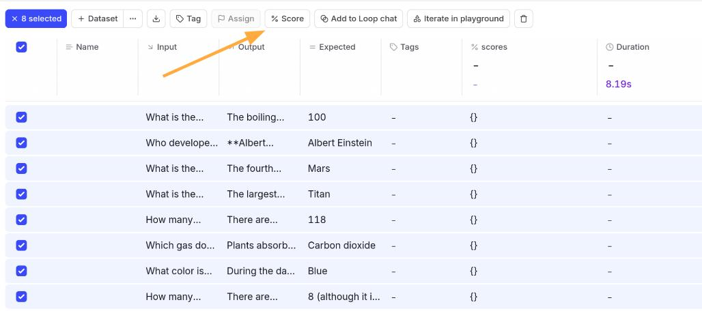

Select the "accuracy_scorer" that we just created and then click the blue "Apply scorers" button.  Braintrust will now process each of the selected questions through the scorer and return a score for each one.  At the top, it will give you the average accuracy score for the entire experiment.  Here is what the results look like after scoring:

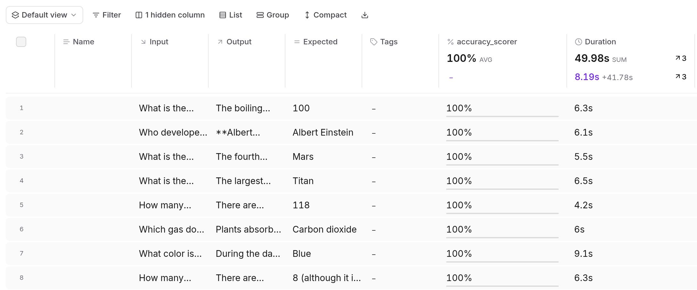

We can see here that this agent achieved an average accuracy score of 100%.  This is not surprising given the very basic nature of this chatbot and the question-answer pairs we created.  In practice as you build more sophisticated agents and workflows, it is very unlikely that you will achieve a perfect score.  In fact, if you do, it is a sign that perhaps you dataset does not truly reflect the nature of what the agent will face in production.  You want to make sure that your dataset fully spans the space of all possible inputs the agent may encounter, especially including edge cases.  If you are using an agent in production, you want to include as many problematic user inputs as possible to monitor improvements over time.

## Conclusion and Next Steps

Congratulations on completing Module 3!  You have successfully set up Braintrust, created an n8n workflow to log experiments to Braintrust, and created a scorer to evaluate the performance of your agent.  There are a few things to remember as you move forward into the challenges:

- Make sure to create comprehensive datasets in Braintrust that fully reflect the range of inputs your agent may encounter.
- Be sure your dataset includes edge cases and problematic inputs to truly test the robustness of your agent.
- Whenever you make a change to your agent or workflow, _especially_ changes to prompts, be sure to log a new experiment to Braintrust to monitor how those changes impact performance.
- When creating an LLM-as-a-judge scorer, you want to consider that your grading prompt is as important as your agent prompt.  It does no good to have a great agent if your scorer is not well-designed to accurately assess its performance!

Braintrust is an incredibly powerful tool for evaluating LLM outputs and agent performance.  In this course we have only had time to scratch the surface of its capabilities.  However, even with this basic introduction, you should be well-equipped to begin using Braintrust to evaluate and improve your own agentic workflows in n8n.